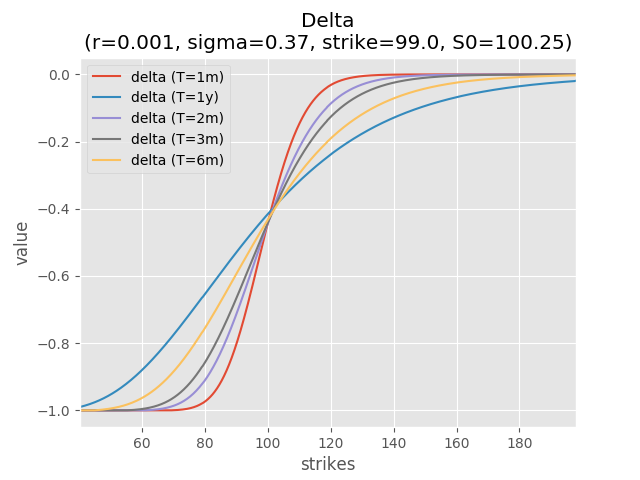

# American put option pricer

Solving American put value under Black-Scholes assumptions.

---
## Numerical PDE method

### References
TODO

### Sample Output

* put pricer
```
# American put (BS model) with following parameters:
# rate             = .01
# sigma            = .3
# strike           = 100.
# init_value       = 100.
# time_to_maturity = 1.

$ python pde.py             # run main()
12.8016950452               # option value at 0.97*strike
11.4472341705               # option value at strike
10.2122740189               # option value at 1.03*strike

```

* put vs payoff
```
$ python plot_pde.py        # price options at different maturities, show a summary plot
```


* delta
```
$ python plot_greeks.py delta
```



* gamma
```
$ python plot_greeks.py gamma
```

